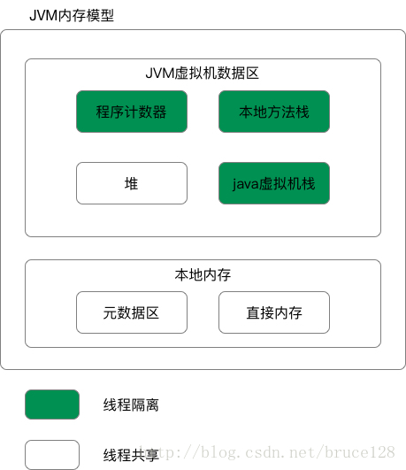
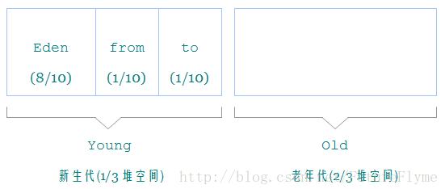

# JVM

## 1.Java实现平台无关的原理
1. java程序
2. Java Api 和 Java 标准拓展Api
3. Java 基类和 Java 标准拓展类
4. Java虚拟机
5. Java移植接口
6. 适配器和Java操作系统，其中适配器实现了依赖于具体平台的部分

JVM通过移植接口实现了程序与操作系统的分离，从而实现了平台无关性。移植接口由适配器和Java操作系统两部分组成，其中依赖具体平台的部分为适配器。

## 2.JVM内存模型

**程序计数器：**
指向当前指令地址

**堆：**
对象内存，字符串常量池，TLAB（新生代Eden Space中开辟了一小块线程私有的区域TLAB,不需要锁且能快速GC）
分为新生代（Eden空间，From Survivor空间，To Survivor空间）和老年代，垃圾回收的主要区域

**虚拟机栈：**
方法执行时创建栈帧（局部变量，操作数栈，方法出口）

**本地方法栈：**
与虚拟机栈一样，但是为native方法服务

**方法区（元数据区）：**
存储已被虚拟机加载的类信息、方法信息、常量、静态变量、字节码等。1.8中用本地内存中的元空间替代了永久代。

**直接内存：**
NIO可以使用Native方式直接在Native堆分配内存。

## 3.类加载机制
**初始化时机**
new、静态字段或方法被使用、反射、作为父类、main函数调用

**加载过程**
1. 加载（获取字节流并转换成运行时数据结构，然后生成Class对象）
2. 验证（验证字节流信息符合当前虚拟机的要求）
3. 准备（为类变量分配内存并设置初始值）
4. 解析（将常量池的符号引用替换为直接引用）
  * 符号引用与虚拟机实现的布局无关，引用的目标并不一定要已经加载到内存中。各种虚拟机实现的内存布局可以各不相同，但是它们能接受的符号引用必须是一致的，因为符号引用的字面量形式明确定义在Java虚拟机规范的Class文件格式中。  
* 直接引用可以是指向目标的指针，目标已经存在于内存中。
5. 初始化（执行类构造器-类变量赋值和静态块的过程）

**类加载器**
**①Bootstrap ClassLoader**
负责加载$JAVA_HOME中/lib下的核心类库，由C++实现，不是ClassLoader子类

**②Extension ClassLoader**
负责加载$JAVA_HOME中/lib/ext或者由系统变量-Djava.ext.dir指定位路径中的类库

**③Application ClassLoader**
负责记载classpath中指定的jar包及目录中class

**④Custom ClassLoader**
属于应用程序根据自身需要自定义的ClassLoader

*双亲委派模式*
自上而下地调用类加载器加载类，父加载器无法加载才执行子加载器。
避免了重复加载，防止恶意覆盖Java核心Api

*实现自定义类加载器*
继承Classloader并重写findClass。
因为loadClass方法保证了双亲委派机制，所以尽量不要重写它，在loadClass中会调用findClass

## 4. jdk动态代理和CGLib动态代理
**jdk动态代理**
jdk动态代理使用反射实现，被代理类需要实现某一接口，代理类需要实现InvocationHandler接口。通过接口中的方法名，在动态生成的代理类中调用业务实现类的同名方法
1. 定义代理类实现InvocationHandler接口,实现bind方法用来获取代理对象，invoke方法用来添加需要动态添加的逻辑。
2. bind方法通过调用Proxy.newProxyInstance获取动态代理对象，参数有被代理类的类加载器，被代理方法，代理类对象。
3. invoke方法参数有，被代理类对象，被代理方法,方法参数。
4. 使用时先创建被代理对象和代理类，通过代理类的bind方法绑定被代理对象。

**CGLib动态代理**
CGLib转换字节码生成新的类，通过继承业务类，生成的动态代理类是业务类的子类，通过重写业务方法进行代理。需要添加asm包处理字节码。
1. 实现 MethodInterceptor方法代理接口，创建代理类，实现getInstance用来获取代理对象，intercept方法用来添加需要动态添加的逻辑
2. getInstance类似于jdk代理的bind方法，intercept类似于jdk的invoke的方法
3. 使用时先创建被代理对象和代理类，通过代理类的getInstance方法绑定被代理对象。

## 5.堆内存分配

**新生代**
优先在新生代分配内存

**老年代**
1. 大对象，-XX:PretenureSizeThreshold 大于这个参数的对象直接在老年代分配
2. 经过第一次Minor GC仍然存在，能被Survivor容纳，就会被移动到Survivor中，此时年龄为1，当年龄大于预设值就进入老年代
3. 如果Survivor中相同年龄所有对象大小的总和大于Survivor空间的一半，年龄大于等于该年龄的对象进入老年代
4. 经过第一次Minor GC仍然存在，但不能被Survivor容纳

## 6.GC回收机制
**回收算法**
可达性分析
引用计数法

**回收对象**
条件1：通过GC Roots作为起点的向下搜索形成引用链，没有搜到该对象，这是第一次标记。
条件2：在finalize方法中没有逃脱回收（将自身被其他对象引用），这是第一次标记的清理。

GC Roots包括：虚拟机栈中引用的对象、方法区中类静态属性引用的对象、方法区中常量引用的对象、本地方法栈中JNI（Native方法）引用的对象。

**如何回收**
新生代因为每次GC都有大批对象死去，只需要付出少量存活对象的复制成本且无碎片所以使用“复制算法”
老年代因为存活率高、没有分配担保空间，所以使用“标记-清理”或者“标记-整理”算法

*复制算法*
将可用内存按容量划分为Eden、from survivor、to survivor，分配的时候使用Eden和一个survivor，Minor GC后将存活的对象复制到另一个survivor，然后将原来已使用的内存一次清理掉。这样没有内存碎片。

*标记清除*  
首先标记出所有需要回收的对象，标记完成后统一回收被标记的对象。会产生大量碎片，导致无法分配大对象从而导致频繁GC。

*标记整理*
首先标记出所有需要回收的对象，让所有存活的对象向一端移动。

**Minor GC 条件**
当Eden区空间不足以继续分配对象，发起Minor GC。

**Full GC 条件**
1.调用System.gc时，系统建议执行Full GC，但是不必然执行
2.老年代空间不足（通过Minor GC后进入老年代的大小大于老年代的可用内存）
3.方法区空间不足
4.通过Minor GC后进入老年代的平均大小大于老年代的可用内存

## 7.引用类型
1. 强引用：用new创建，只要强引用存在，就不会被GC回收  
2. 软引用：用SoftReference实现，在内存快溢出时，列入第二次回收范围
3. 弱引用：用WeakReference实现，只能存活到下一次GC
4. 虚引用：用PhantomReference实现，一般用于系统通知该对象被回收

## 8.finalize的自救
如果在该方法中重新让对象被引用，则不会被GC回收

## 9. 垃圾收集器
收集器|串行/并行/并发|新生代/老生代|算法|目标|适用场景
-|-|-|-|-|-
Serial|串行|新生代|复制|响应速度优先|单CPU环境下的Client模式
Serial Old|串行|老年代|标记-整理|响应速度优先|单CPU环境下的Client模式、CMS的后备方案
ParNew|并行|新生代|复制|响应速度优先|多CPU环境时在Server模式下与CMS配合
Parallel Scavenge|并行|新生代|复制|吞吐量优先|在后台运算而不需要太多交互的任务
Parallel Old|并行|老年代|标记-整理|吞吐量优先|在后台运算而不需要太多交互的任务
CMS|并发|老年代|标记-清除|响应速度优先|集中在互联网站或B/S系统服务端上的Java应用
G1|并发|新生代/老年代|标记-整理、复制|响应速度优先|面向服务端应用、将来替换CMS
