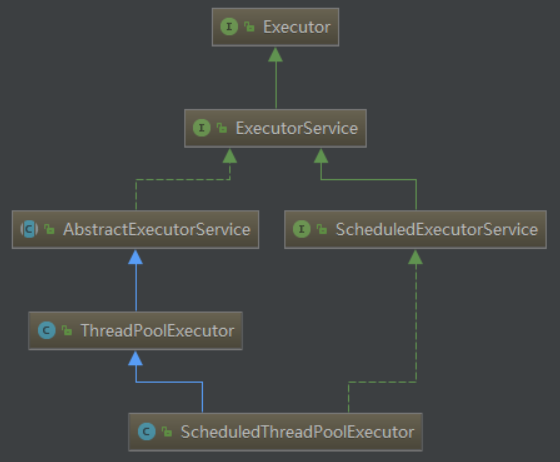

# 并发
##1. 三个概念
原子性  ，可见性  ，有序性

## 2.创建线程的三种方法
继承Thread，实现Runnable，实现Callable

## 3.synchronized [参考](http://www.cnblogs.com/dolphin0520/p/3923737.html)
java的内置锁，是重量级锁，可重入锁。  

优点：使用便捷  
缺点：性能没有Lock好，不能并发读  

锁对象时，会显示调用monitorenter和monitorexit指令，类似于操作系统的pv操作。
Monitor：每个对象都有一个内置监视器  
_EntryList：保存访问的多个线程
_WaitSet：保存调用wait()方法的等待线程
_owner：指向持有Monitor对象的线程
流程：当多个线程同时访问代码块时，先进入_EntryList,当线程获取到对象的Monitor后把_owner指向当前线程，同时Monitor计数器+1.当线程调用wait()方法时进入_WaitSet等待被唤醒,释放Moniter，_owner=null，计数器-1

锁类时，在class文件的方法表中将该方法的access_synchronized置为1,JVM通过该标识辨别是否为同步方法。

jdk1.6的锁优化：
偏向锁---01, 无锁竞争  
轻量级锁---00,线程交替执行同步块  
重量级锁---10,多线程竞争
GC标记---11
自旋锁
锁消除---StrubgBuffer消除内部锁

## 4.各种Lock [参考](http://www.cnblogs.com/dolphin0520/p/3923167.html)
### Lock接口
lock()、tryLock()、tryLock(long time, TimeUnit unit)和lockInterruptibly()是用来获取锁的。unLock()方法是用来释放锁的。
* lock()
    用来获取锁。如果锁已被其他线程获取，则进行等待。
    一般来说，使用Lock必须在try{}catch{}块中进行，并且将释放锁的操作放在finally块中进行，以保证锁一定被被释放，防止死锁的发生。

* tryLock()
    直接返回，获取锁成功true，失败false

* tryLock(long time, TimeUnit unit)
    等待一段时间后返回，获取锁成功true，失败false
  
* lockInteruptibly()
    获取锁时，如果线程正在等待获取锁，则这个线程能够响应中断。

    注意：单独调用interrupt()方法不能中断正在运行过程中的线程，只能中断阻塞过程中的线程。
    因此当通过lockInterruptibly()方法获取某个锁时，如果不能获取到，只有进行等待的情况下，是可以响应中断的。
    而用synchronized修饰的话，当一个线程处于等待某个锁的状态，是无法被中断的，只有一直等待下去。

### ReentrantLock
“可重入锁”，实现了Lock接口。
 可通过newCondition()创建此锁的状态，通过Condition对象的await()方法使线程进入等待状态，可以利用这个实现生产者消费者模型

### ReentrantReadWriteLock
通过readLock()获取读锁，通过writeLock()获取写锁。
1.如果当前有线程占用了读锁，其他线程还是能获取读锁，但不能获取写锁。  
2.如果当前有线程占用了写锁，其他线程不能获取写锁和读锁，等待写锁的释放。  

## 5.Lock VS synchronized
1. Lock是一个接口，而synchronized是Java中的关键字，synchronized是内置的语言实现；
2. synchronized在发生异常时，会自动释放线程占有的锁，因此不会导致死锁现象发生；而Lock在发生异常时，如果没有主动通过unLock()去释放锁，则很可能造成死锁现象，因此使用Lock时需要在finally块中释放锁；
3. Lock可以让等待锁的线程响应中断，而synchronized却不行，使用synchronized时，等待的线程会一直等待下去，不能够响应中断；
4. ReetrantReadWriteLock可以实现多线程并发读，而synchronized不行。

##6. 可重入锁和公平锁
### 可重入锁
如果某个线程试图获取一个已经由它自己持有的锁时，那么这个请求会立刻成功，并且会将这个锁的计数值加1，而当线程退出同步代码块时，计数器将会递减，当计数值等于0时，锁释放。是基于线程分配的。

ReentrantLock 和synchronized 都是可重入锁。可重入锁最大的作用是**避免死锁**。

### 公平锁
按照请求锁的顺序分配锁  
* synchronized就是非公平锁，它无法保证等待的线程获取锁的顺序。
* 而对于ReentrantLock和ReentrantReadWriteLock，它默认情况下是非公平锁，但是可以设置为公平锁。

## 7.volatile [参考](http://www.cnblogs.com/dolphin0520/p/3920373.html)
### 保证可见性

### 在一定程序上保证有序性
* 禁止进行指令重排序两层含义
    1. 当程序执行到volatile变量的读操作或者写操作时，在其前面的操作的更改肯定全部已经进行，且结果已经对后面的操作可见；在其后面的操作肯定还没有进行；
    2. 在进行指令优化时，不能将在对volatile变量访问的语句放在其后面执行，也不能把volatile变量后面的语句放到其前面执行。

### 不能保证原子性
自增操作是不具备原子性的，它包括读取变量的原始值、进行加1操作、写入工作内存。

### 注意
当一个域依赖于它之前的值或者依赖其他的域的值，volatile就无法工作。

## ThreadLocal
1. ThreadLocal类中有一个ThreadLocalMap，其中的键值对是弱引用的（只能存活到下一次GC）
2. 每个Thread内部都有一个ThreadLocalMap的成员变量。
3. ThreadLocalMap 的 set 方法通过调用 replaceStaleEntry 方法回收键为 null 的 Entry 对象的值（即为具体实例）以及 Entry 对象本身从而防止内存泄漏。

### 适用场景
如上文所述，ThreadLocal 适用于如下两种场景
1. 每个线程需要有自己单独的实例
2. 实例需要在多个方法中共享，但不希望被多线程共享

## ConcurrentModificationException
1. 使用Iterator遍历ArrayList时使用ArrayList的remove(Object)方法，导致modCount与expectedModCount不一致，抛出ConcurrentModificationException;  
通过调用Iterator的remove方法。
2. 虽然Vector的方法采用了synchronized进行了同步，但是实际上通过Iterator访问的情况下，每个线程里面返回的是不同的iterator，也即是说expectedModCount是每个线程私有。假若此时有2个线程，线程1在进行遍历，线程2在进行修改，那么很有可能**导致线程2修改后导致Vector中的modCount自增了，线程2的expectedModCount也自增了，但是线程1的expectedModCount没有自增**，此时线程1遍历时就会出现expectedModCount不等于modCount的情况了。

解决方案：
1. 在使用iterator迭代的时候使用synchronized或者Lock进行同步；
1. 使用并发容器CopyOnWriteArrayList代替ArrayList和Vector。

## CAS
### 无锁概念

### 核心算法
CAS的全称是 Compare And Swap，即比较交换。
CAS 中包含3个参数
* V 内存值
* A 旧的预期值
* B 要修改的新值

1. 如果内存值等于旧的预期值，则将内存值设置成要修改的新值；
2. 若内存值不等于旧的预期值值，说明已有其他线程做了更新，可以选择重新读取该变量再尝试修改该变量，也可以放弃操作。

### Unsafe类
可以像C的指针一样直接操作内存，CAS操作的执行依赖于Unsafe类的方法，Unsafe类中的所有方法都是native修饰的。

#### CAS相关操作
compareAndSwap的四个参数：需要改变的对象，要改变的属性在对象中的偏移量，旧的预期值，要修改的新值。

### Atomic包
#### 基本类型
* AtomicBoolean：原子更新布尔类型
* AtomicInteger：原子更新整型
* AtomicLong：原子更新长整型

#### 实现原理（AtomicInteger为例）
1. 通过unsafe的objectFieldOffset获取要修改的属性在类中的偏移量
2. 通过unsafe的cas操作完成原子更新操作

### ABA问题及解决方案
* 问题：
    其他线程将某个属性反复修改后最终还原成了原来的值，在cas操作时好像没有变更一样
* 解决：
    使用原子类：
    AtomicStampedReference类
    * AtomicStampedReference原子类
        修改时带有时间戳。

## AQS [参考1](https://www.cnblogs.com/waterystone/p/4920797.html) [参考2](https://blog.csdn.net/lightofmiracle/article/details/73104926)
### 框架

它维护了一个volatile int state（代表共享资源）和一个FIFO线程等待队列

AQS定义了两种资源共享方式：Exclusive（独占，只有一个线程能执行，如ReentrantLock）和Share（共享，多个线程可同时执行，如Semaphore/CountDownLatch）。

自定义同步器实现主要实现以下几种方法：
* isHeldExclusiveLy()：该线程是否正在独占资源。只有用到condition才需要去实现它。
* tryAcquire(int)：独占方式。尝试获取资源，成功则返回true，失败则返回false。
* tryRelease()：独占方式。尝试释放资源，成功则返回true，失败则返回false。
* addWaiter:将线程加入等待队列尾部，并标记为独占模式，返回当前线程所在的节点。
* aquireQueued:使线程在等待队列中获取资源，有机会时调用unpark尝试获取资源，如果在等待过程中被中断，返回true，否则返回false
* acquire：tryAquire尝试获取资源，成功直接返回，失败则调用addWaiter进入等待队列，并标记为独占模式，accquireQueued使线程在等待队列中休息，直到被unpark或interrupt尝试获取资源，等待时被中断返回true，否则返回false。（线程在等待过程中是忽略中断的，获取资源后调用selfInterrupt将中断补上。）
* tryAcquireShared(int)：共享方式。尝试获取资源，负数表示失败；0表示成功，但没有剩余可用资源；正数表示成功，且有剩余资源。
* tryReleaseShared(int)：共享方式。尝试释放资源，如果释放后允许唤醒后序等待结点返回true，否则返回false。
* doAccquireShared进入等待队列，直到被unpark或interrupt并获取资源成功，同时唤醒下一个线程获取资源。
* acquireShared流程:tryAquireShared尝试获取资源，成功直接返回true，失败则调用doAccquireShared进入等待队列，直到被unpark或interrupt并获取资源成功，同时唤醒下一个线程获取资源。整个过程也是忽略中断的。

## CountDownLatch
等待一组线程执行到某个状态后主线程才执行  
1. CountDownLatch cd = new CountDownLatch(N); //N为需要调用N次才能获取锁
2. 在主线程中调用cd.await();//使主线程阻塞
3. 在子线程中调用cd.countDown();//调用N次后，主线程获取锁，继续执行。

## CyclicBarrier
一组线程互相等待至某个状态后继续执行，并且CyclicBarrier是可重用的
1. CyclicBarrier barrier  = new CyclicBarrier(N);
2. 在子线程中调用 barrier.await();//等待其他线程的状态
3. 当执行了N次barrier.await()之后，所有子线程获取锁，同时继续执行

## Semaphore
信号量机制，acquire类似于P操作，relase类似于V操作
1. Semaphore semaphore = new Semaphore(5);//表示有五个资源可用
2. semaphore.acquire();//尝试获取临界资源，有剩余资源时成功返回，没有时阻塞等待。
3. semaphore.relase();//释放临界资源，通知其他线程获取临界资源。

## Executor框架
### 框架

* Executor：一个接口，其定义了一个接收Runnable对象的方法executor，其方法签名为executor(Runnable command)
* Executors：提供了若干个静态方法，用于生成不同类型的线程池。
* ExecutorService：是一个比Executor使用更广泛的子类接口，其提供了生命周期管理的方法，以及可跟踪一个或多个异步任务执行状况返回Future的方法
* AbstractExecutorService：ExecutorService执行方法的默认实现
* ScheduledExecutorService：一个可定时调度任务的接口
* ScheduledThreadPoolExecutor：ScheduledExecutorService的实现，一个可定时调度任务的线程池
* ThreadPoolExecutor：线程池，可以通过调用Executors以下静态工厂方法来创建线程池并返回一个ExecutorService对象

### Executors
可通过静态方法创建以下四种线程池
* newCachedThreadPool创建一个可缓存线程池，如果线程池长度超过处理需要，可灵活回收空闲线程，若无可回收，则新建线程。
* newFixedThreadPool 创建一个定长线程池，可控制线程最大并发数，超出的线程会在队列中等待。
* newScheduledThreadPool 创建一个线程池，它可安排在给定延迟后运行命令或者定期地执行。
* newSingleThreadExecutor 创建一个使用单个 worker 线程的 Executor，以无界队列方式来运行该线程。它只会用唯一的工作线程来执行任务，保证所有任务按照指定顺序(FIFO, LIFO, 优先级)执行。

### ThreadPoolExecutor [参考1](https://www.cnblogs.com/leesf456/p/5585627.html) [参考2](http://www.cnblogs.com/dolphin0520/p/3932921.html) [参考3](https://blog.csdn.net/rebirth_love/article/details/51954836)

各个参数含义：
* corePoolSize: 核心池的大小，这个参数跟后面讲述的线程池的实现原理有非常大的关系。在创建了线程池后，默认情况下，线程池中并没有任何线程，而是等待有任务到来才创建线程去执行任务，除非调用了prestartAllCoreThreads()或者prestartCoreThread()方法，从这2个方法的名字就可以看出，是预创建线程的意思，即在没有任务到来之前就创建corePoolSize个线程或者一个线程。默认情况下，在创建了线程池后，线程池中的线程数为0，当有任务来之后，就会创建一个线程去执行任务，当线程池中的线程数目达到corePoolSize后，就会把到达的任务放到缓存队列当中；
* maximumPoolSize：线程池最大线程数，这个参数也是一个非常重要的参数，它表示在线程池中最多能创建多少个线程；
* keepAliveTime：表示线程没有任务执行时最多保持多久时间会终止。默认情况下，只有当线程池中的线程数大于corePoolSize时，keepAliveTime才会起作用，直到线程池中的线程数不大于corePoolSize，即当线程池中的线程数大于corePoolSize时，如果一个线程空闲的时间达到keepAliveTime，则会终止，直到线程池中的线程数不超过corePoolSize。但是如果调用了allowCoreThreadTimeOut(boolean)方法，在线程池中的线程数不大于corePoolSize时，keepAliveTime参数也会起作用，直到线程池中的线程数为0；
* unit：参数keepAliveTime的时间单位。
* workQueue：一个阻塞队列，用来存储等待执行的任务，这个参数的选择也很重要，会对线程池的运行过程产生重大影响，一般来说，这里的阻塞队列有以下几种选择：
    * ArrayBlockingQueue;
    * LinkedBlockingQueue;
    * SynchronousQueue;
    ArrayBlockingQueue和PriorityBlockingQueue使用较少，一般使用LinkedBlockingQueue和Synchronous。线程池的排队策略与BlockingQueue有关。
* threadFactory：线程工厂，主要用来创建线程；
* handler：表示当拒绝处理任务时的策略。

### 异步队列
* Future + ExecutorService,通过executorService.invokeAll或invokeAny提交Callable任务.
* BlockingQueue
* CountDownLautch,CyclicBarrier
* Lock + Condition