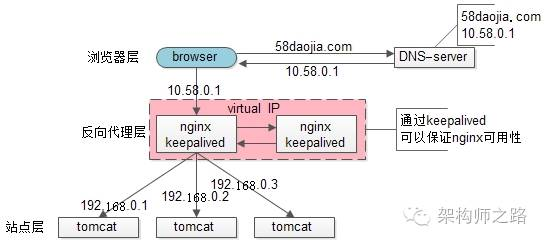
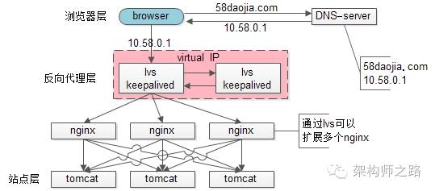

# 架构问题

## 部署策略
###1. dns轮询问

**架构：**
域名注册时对同一域名添加多条A记录,实现DNS轮询,DNS服务器将解析请求按照记录的顺序,随机分配到不同的IP上,实现简单的负载均衡 

**优点：**
1）零成本：在DNS-server上多配几个ip即可，功能也不收费
2）部署简单：多部署几个web-server即可，原系统架构不需要做任何改造
3）负载均衡：变成了多机，但负载基本是均衡的

**缺点：**
1）非高可用：DNS-server只负责域名解析ip，这个ip对应的服务是否可用，DNS-server是不保证的，假设有一个web-server挂了，部分服务会受到影响
2）扩容非实时：DNS解析有一个生效周期
3）暴露了太多的外网ip

### 2. nginx反响代理
**架构：**
nginx将请求转发到各个tomcat服务器上
**优点：**
1）DNS-server不需要动
2）负载均衡：通过nginx来保证
3）只暴露一个外网ip，nginx->tomcat之间使用内网访问
4）扩容实时：nginx内部可控，随时增加web-server随时实时扩容
5）能够保证站点层的可用性：任何一台tomcat挂了，nginx可以将流量迁移到其他tomcat

**缺点：**
1）时延增加+架构更复杂了：中间多加了一个反向代理层
2）反向代理层成了单点，非高可用：tomcat挂了不影响服务，nginx挂了怎么办？

### 3. keepalived  

**架构：**
1）做两台nginx组成一个集群，分别部署上keepalived，设置成相同的虚IP，保证nginx的高可用
2）当一台nginx挂了，keepalived能够探测到，并将流量自动迁移到另一台nginx上，整个过程对调用方透明
**优点：**
1）解决了高可用的问题

**缺点：**
1）资源利用率只有50%
2）nginx仍然是接入单点，吞吐量上限为单个nginx性能上限

### 4. lvs/f5 
lvs实施在操作系统层面；f5实施在硬件层面；

**架构：**
1）通过lvs来扩展多个nginx
2）通过keepalived+VIP的方案可以保证可用性

不管是使用lvs还是f5，这些都是纵向扩展的方案，根本上，lvs/f5还是会有性能上限，假设每秒能处理10w的请求，一天也只能处理80亿的请求（10w秒吞吐量*8w秒），那万一系统的日PV超过80亿怎么办呢？（好吧，没几个公司要考虑这个问题）

### 5. 横向拓展方案(DNS轮询)
**架构：**
1）通过DNS轮询来线性扩展入口lvs层的性能
2）通过keepalived来保证高可用
3）通过lvs来扩展多个nginx
4）通过nginx来做负载均衡，业务七层路由

